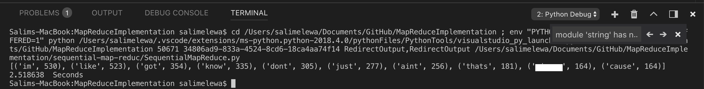

# MapReduceImplementation
# Ahmed Samy Merah: 991418644
# Salim Elewa: 991463094

Language choice for each version (sequential & distributed) -> Python for both implementations

IMPORTANT!!!!!!!!!!!!
For sequential run the conda base (3.7.5) version of the python compiler

IMPORTANT!!!!!!!!!!!!
For parralel run the regular Python 3.7.5 version of the python compiler

Approach of distributed way: Multiprocessor, because to be honest we took the easy way out with the tutorial, sowwie.

Output for sequential:

Output for distributed:

